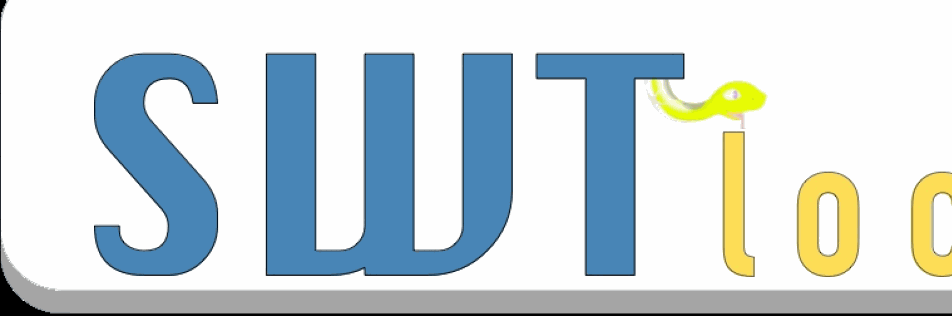
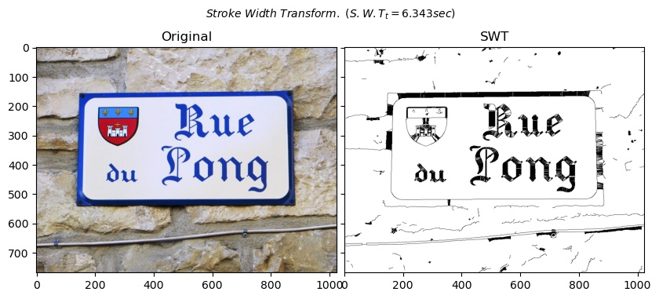
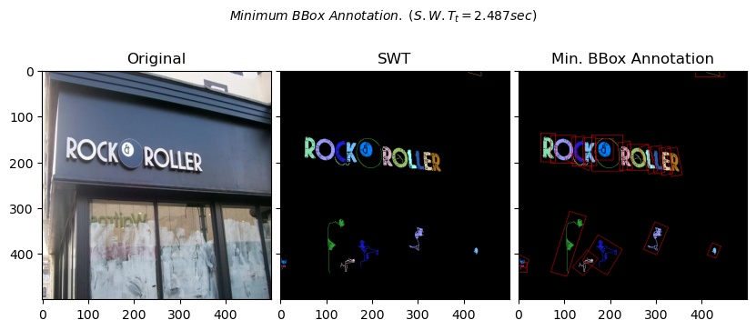
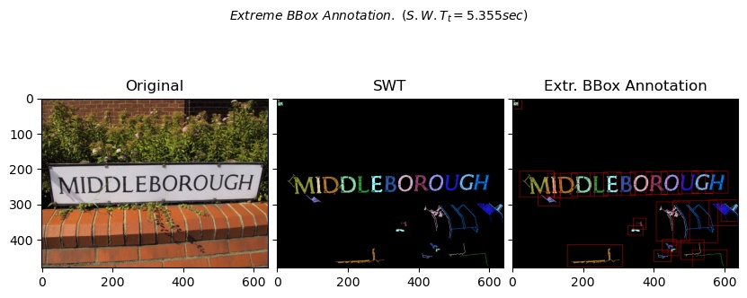
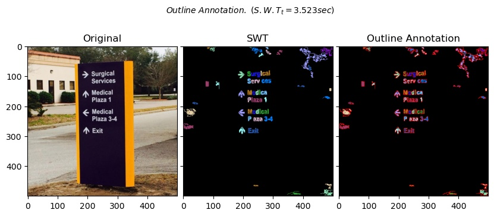
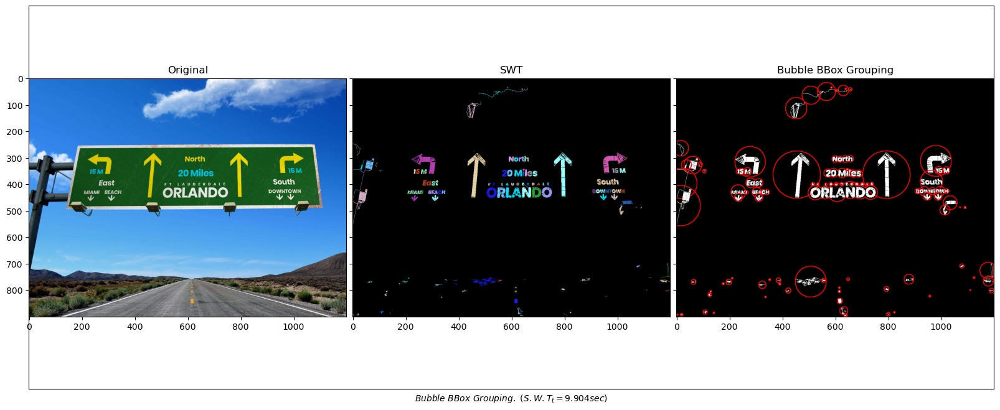
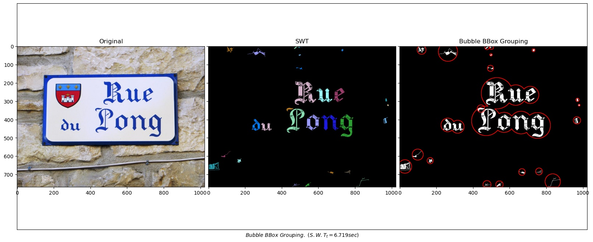
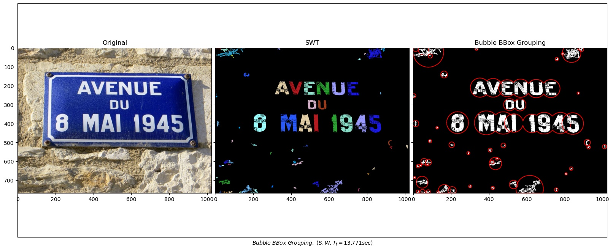
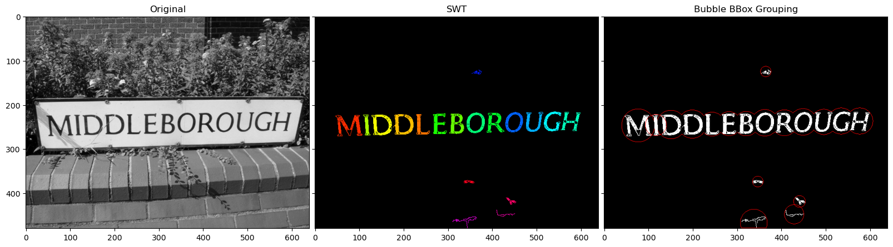

# SWTloc : Stroke Width Transform Text Localizer


[](https://pypi.org/project/swtloc/)
[](https://pypi.org/project/swtloc/)
[](https://pypi.org/project/swtloc/)

## Description

This repo contains a python implementation structured as a python package pertaining to the text localization method as in a natural image as outlayed in the Research Paper :- 

[Detecting Text in Natural Scenes with Stroke Width Transform.
Boris Epshtein, Eyal Ofek & Yonatan Wexler
(June, 2010)](https://www.microsoft.com/en-us/research/publication/detecting-text-in-natural-scenes-with-stroke-width-transform/)



## Installation
****
Installation 
```py
pip install swtloc
```

## Usage
****
- ### Stroke Width Transform
    This function applies Stroke Width Transform on a list of images(loaded from list of imagepaths, internally) or a single image(loaded from imagepath or a pre-loaded image), and once done with the transformation the results are stored in the directory mentioned in `save_rootpath` parameter, under the name of the image being processed
    
    *NOTE : If you are processing multiple images with same name, the stored results will be overridden, Process images with different names.

    ```py
    from swtloc import SWTLocalizer
    import numpy as np
    
    swtl = SWTLocalizer()
    imgpaths = ... # Image paths, can be one image(path as str) or more than one(paths as list of str)
    swtl.swttransform(imgpaths=imgpath, save_results=True, save_rootpath='swtres/',
                      edge_func = 'ac', ac_sigma = 1.0, text_mode = 'lb_df',
                      gs_blurr=True, blurr_kernel = (5,5), minrsw = 3, 
                      maxCC_comppx = 10000, maxrsw = 200, max_angledev = np.pi/6, 
                      acceptCC_aspectratio = 5.0)
    # If you have a pre-loaded image then
    loaded_image = cv2.imread(imgpath)
    swtl.swttransform(image=loaded_image, save_results=True, save_rootpath='swtres/',
                      edge_func = 'ac', ac_sigma = 1.0, text_mode = 'lb_df',
                      gs_blurr=True, blurr_kernel = (5,5), minrsw = 3, 
                      maxCC_comppx = 10000, maxrsw = 200, max_angledev = np.pi/6, 
                      acceptCC_aspectratio = 5.0)
    ```
    

    ****
- ### Individual & Grouped Bounding Boxes and Annotations
    These group of functions returns bounding boxes to individual components and grouped bounding boxes of words.
    - *Minimum CC Bounding Boxes*

        Generate Minimum Bounding box for each of the Connected Components after applying SWT, can be a rotated rectangle.
        ```py
        min_bboxes, min_bbox_annotated = swtl.get_min_bbox(show=True, padding=10)
        ```
        
    - *Extreme CC Bounding Boxes*

        Generate External Bounding box for each of the Connected Components after applying SWT.
        ```py
        min_bboxes, min_bbox_annotated = swtl.get_extreme_bbox(show=True, padding=10)
        ```
        
    - *CC Outline*

        Generate Outline of each of the Connected Components after applying SWT.
        ```py
        comp_outlines, comp_outline_annot = swtl.get_comp_outline(show=True, padding=10)
        ```
        
    - *CC Bubble Bounding Boxes*

        Generate Bubble Bounding box for the **grouped letters into a word**.
        ```py
        respacket = swtl.get_grouped(lookup_radii_multiplier=1, sw_ratio=2,
                             cl_deviat=[13,13,13], ht_ratio=2, 
                             ar_ratio=3, ang_deviat=30)
        
        grouped_labels = respacket[0]
        grouped_bubblebbox = respacket[1]
        grouped_annot_bubble = respacket[2]
        grouped_annot = respacket[3]
        maskviz = respacket[4]
        maskcomb  = respacket[5]
        ```
        
        
        

        

        
        
    *CC = Connected Component


## History Logs
****
<u>v1.1.1 : Refine Versioning System</u>
- New versioning system defined : x[Major Update].x[Minor Update].x[Fixes]
- Tag 1.1.x Represents all bug fixed versions of 1.1. 
- Bug Fixes

<u>v1.0.0.3 : Add Individual Image Processsing</u>
- Functionality to transform pre-loaded image
- Minor Bug Fixes
- Add support for Python 3.6
- Reduce Dependency

<u>v1.0.0.2 : Few bug fixes and addendums</u>
- Add parameter to govern the width of BubbleBBox 
- Add Examples - StackOverflow Q/A
- Add image resizing utility function to the utils.py

<u>v1.0.0.1 : Original Package</u>
- Add SWTlocaliser to the package
- Add the logic for Bubble Bounding Boxes
- Add Examples

