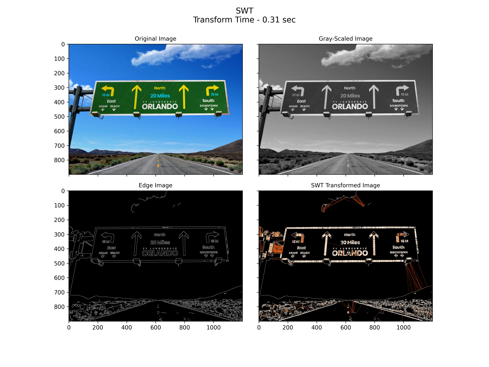
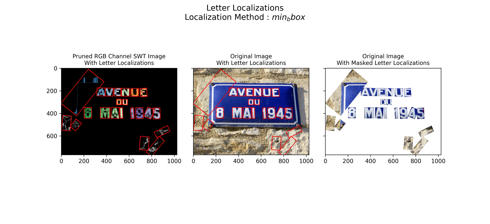

# SWTloc : Stroke Width Transform Text Localizer


[](https://pypi.org/project/swtloc/)
[](https://pypi.org/project/swtloc/)
[](https://pypi.org/project/swtloc/)

## Description

This repo contains a python implementation structured as a python package pertaining to the text localization method as in a natural image as outlayed in the Research Paper :- 

[Detecting Text in Natural Scenes with Stroke Width Transform.
Boris Epshtein, Eyal Ofek & Yonatan Wexler
(June, 2010)](https://www.microsoft.com/en-us/research/publication/detecting-text-in-natural-scenes-with-stroke-width-transform/)


This library extends the transformation stage of the image for textual content by giving the ability to :

- Localize `Letter`'s : through `SWTImage.localizeLetters`
- Localize `Words`'s, via fusing individual `Letter`'s : through `SWTImage.localizeWords`

The process flow of is depicted in the image below : 


****
### Installation 
```py
pip install swtloc
```

****
## Speed Benchmarking
Below is the speed comparison between different versions of ``SWTLoc`` and their various engines. The time measured for
each test image was calculated based on 10 iterations of 10 runs each.

Test Image | SWT v1.1.1 (Python) | SWT v1.1.1 (Python) [x] | SWT v2.0.0 (Python) | SWT v2.0.0 (Python) [x] | SWT v2.0.0 (numba) | SWT v2.0.0 (numba) [x]
--- | --- | --- | --- |--- |--- |--- 
test_img1.jpg | 15.614 seconds | 1.0x | 8.071 seconds | 1.935x | 0.308 seconds | 50.695x
test_img2.jpg | 9.644 seconds | 1.0x | 4.173 seconds | 2.311x | 0.176 seconds | 54.829x
test_img3.jpg | 4.386 seconds | 1.0x | 2.638 seconds | 1.663x | 0.083 seconds | 53.104x
test_img4.jpeg | 7.225 seconds | 1.0x | 3.887 seconds | 1.858x | 0.14 seconds | 51.42x
test_img5.jpg | 16.338 seconds | 1.0x | 7.592 seconds | 2.152x | 0.3 seconds | 54.405x
test_img6.jpg | 4.831 seconds | 1.0x | 2.873 seconds | 1.682x | 0.083 seconds | 57.853x

****
## Frequently Used Code Snippets
### Performing Stroke Width Transformation
```python
# Installation
# !pip install swtloc

# Imports
import swtloc as swt
from swtloc.configs import (IMAGE_ORIGINAL,
                            IMAGE_GRAYSCALE,
                            IMAGE_EDGED,
                            IMAGE_SWT_TRANSFORMED)
# Image Path
imgpath = 'examples/images/test_image_5/test_img5.jpg'
# Result Path
respath = 'examples/images/test_image_5/usage_results/'
# Initializing the SWTLocalizer class with the image path
swtl = swt.SWTLocalizer(image_paths=imgpath)
# Accessing the SWTImage Object which is housing this image
swtImgObj = swtl.swtimages[0]
# Performing Stroke Width Transformation
swt_mat = swtImgObj.transformImage(text_mode='db_lf')
```


### Localizing & Annotating Letters and Generating Crops of Letters
```python
# Installation
# !pip install swtloc

# Imports
import swtloc as swt
from cv2 import cv2
from swtloc.configs import (IMAGE_ORIGINAL,
                            IMAGE_GRAYSCALE,
                            IMAGE_EDGED,
                            IMAGE_SWT_TRANSFORMED)
# Image Path
imgpath = 'examples/images/test_image_1/test_img1.jpg'
# Read the image
img = cv2.imread(imgpath)
# Result Path
respath = 'examples/images/test_image_1/usage_results/'
# Initializing the SWTLocalizer class with a pre loaded image
swtl = swt.SWTLocalizer(images=img)
swtImgObj = swtl.swtimages[0]
# Perform Stroke Width Transformation
swt_mat = swtImgObj.transformImage(text_mode='db_lf',
                                   maximum_angle_deviation=np.pi/2,
                                   gaussian_blurr_kernel=(11, 11),
                                   minimum_stroke_width=5,
                                   maximum_stroke_width=50,
                                   display=False)  # NOTE: Set display=True 
# Find And Prune Connected Components <- Finding Letters
image_cc, pruned_image_cc = swtImgObj.findAndPruneConnectedComponents(minimum_pixels_per_cc=950,
                                                                      maximum_pixels_per_cc=5200,
                                                                      display=False)  # NOTE: Set display=True 
# Calculate and Draw Letter Annotations
localized_letters = swtImgObj.localizeLetters()
letter_labels = [int(k) for k in list(localized_letters.keys())]
```


```python
# Some Other Helpful Letter related functions
# # Query a single letter
loc_letter, swt_loc, orig_loc = swtImgObj.getLetter(key=letter_labels[5])

# # Iterating over all the letters
# # Specifically useful for jupyter notebooks - Iterate over all
# # the letters, at the same time visualizing the localizations
letter_gen = swtImgObj.letterIterator()
loc_letter, swt_loc, orig_loc = next(letter_gen)

# # Generating a crop of a single letter on any of the available
# # image codes.
# # Crop on SWT Image
swtImgObj.saveCrop(save_path=respath,crop_of='letters',crop_key=6, crop_on=IMAGE_SWT_TRANSFORMED, crop_type='min_bbox')
# # Crop on Original Image
swtImgObj.saveCrop(save_path=respath,crop_of='letters',crop_key=6, crop_on=IMAGE_ORIGINAL, crop_type='min_bbox')
```

### Localizing & Annotating Words and Generating Crops of Words
```python
# Installation
# !pip install swtloc
# Imports
import swtloc as swt
from cv2 import cv2
from swtloc.configs import (IMAGE_ORIGINAL,
                            IMAGE_GRAYSCALE,
                            IMAGE_EDGED,
                            IMAGE_SWT_TRANSFORMED)
# Image Path
imgpath = 'examples/images/test_image_2/test_img2.jpg'
# Result Path
respath = 'examples/images/test_image_2/usage_results/'
# Initializing the SWTLocalizer class with the image path
swtl = swt.SWTLocalizer(image_paths=imgpath)
swtImgObj = swtl.swtimages[0]
# Perform Stroke Width Transformation
swt_mat = swtImgObj.transformImage(maximum_angle_deviation=np.pi/2,
                                   gaussian_blurr_kernel=(9, 9),
                                   minimum_stroke_width=3,
                                   maximum_stroke_width=50,
                                   include_edges_in_swt=False,
                                   display=False)  # NOTE: Set display=True 
# Find And Prune Connected Components <- Finding Letters
image_cc, pruned_image_cc = swtImgObj.findAndPruneConnectedComponents(minimum_pixels_per_cc=400,
                                                                      maximum_pixels_per_cc=6000,
                                                                      display=False)  # NOTE: Set display=True 

# Calculate and Draw Letter Annotations
localized_letters = swtImgObj.localizeLetters(display=False)  # NOTE: Set display=True 

# Calculate and Draw Words Annotations
localized_words = swtImgObj.localizeWords(display=True)
word_labels = [int(k) for k in list(localized_words.keys())]
```


****
## Usage 
These code blocks can be found in [SWTloc Usage [v2.0.0 onwards].ipynb](examples/SWTloc-Usage-[v2.0.0-onwards].ipynb)
notebook in examples/.

### Initialisation of ``SWTLocalizer``
- Initialising the  - This is the entry point, which can accept either single image path (str)/
multiple image paths (List[str])/ single image (np.ndarray)/ multiple images (List[np.ndarray]).
```py
from swtloc import SWTLocalizer
imgpath = 'examples/images/test_image_4/test_img4.jpeg'
respath = 'examples/images/test_image_4/usage_results/'
swtl = SWTLocalizer(image_paths=imgpath)
swtImgObj = swtl.swtimages[0]
print(swtImgObj, type(swtImgObj))
swtImgObj.showImage()
```
> SWTImage-test_img4 <class 'swtloc.abstractions.SWTImage'>


### Stroke Width Transformation using ``SWTImage.transformImage``
```py
swt_mat = swtImgObj.transformImage(text_mode='lb_df',
                                   auto_canny_sigma=1.0,
                                   maximum_stroke_width=20)
```


### Finding Connected Components and Pruning them using ``SWTImage.findAndPruneConnectedComponents``
```py
image_1C, pruned_image_1C = swtImgObj.findAndPruneConnectedComponents(minimum_pixels_per_cc=100,
                                                                      maximum_pixels_per_cc=10_000,
                                                                      acceptable_aspect_ratio=0.2)
```


### Localizing Letters using ``SWTImage.localizeLetters``
```py
localized_letters = swtImgObj.localizeLetters()
letter_labels = list([int(k) for k in localized_letters.keys()])
```


### Query a Letter using ``SWTImage.getLetter``
```py
letter_label = letter_labels[3]
locletter = swtImgObj.getLetter(key=letter_label)
```


### Localizing Letters using ``SWTImage.localizeWords``
```py
localized_words = swtImgObj.localizeWords()
word_labels = list([int(k) for k in localized_words.keys()])
```


### Query a Word using ``SWTImage.getWord``
```py
word_label = word_labels[12]
locword = swtImgObj.getWord(key=word_label)
```


### Accessing intermediary stage images using ``SWTImage.showImage`` and saving them
```py
swtImgObj.showImage(image_codes=[IMAGE_ORIGINAL,
                                 IMAGE_ORIGINAL_MASKED_WORD_LOCALIZATIONS],
                    plot_title='Original & Bubble Mask')
```


### Saving Crops of the localized letters and words
```py
# Letter Crops
swtImgObj.saveCrop(save_path=respath, crop_of='letters', crop_key=4, crop_type='min_bbox', crop_on=IMAGE_ORIGINAL)
swtImgObj.saveCrop(save_path=respath, crop_of='letters', crop_key=4, crop_type='min_bbox', crop_on=IMAGE_SWT_TRANSFORMED)

# Word Crops
swtImgObj.saveCrop(save_path=respath, crop_of='words', crop_key=13, crop_type='bubble', crop_on=IMAGE_ORIGINAL)
swtImgObj.saveCrop(save_path=respath, crop_of='words', crop_key=13, crop_type='bubble', crop_on=IMAGE_SWT_TRANSFORMED)
```
> Letter Crops
<p align="middle" title="Letter Crops">
  
   
</p>

> Word Crops
<p align="middle" title="Word Crops">
  
   
</p>
