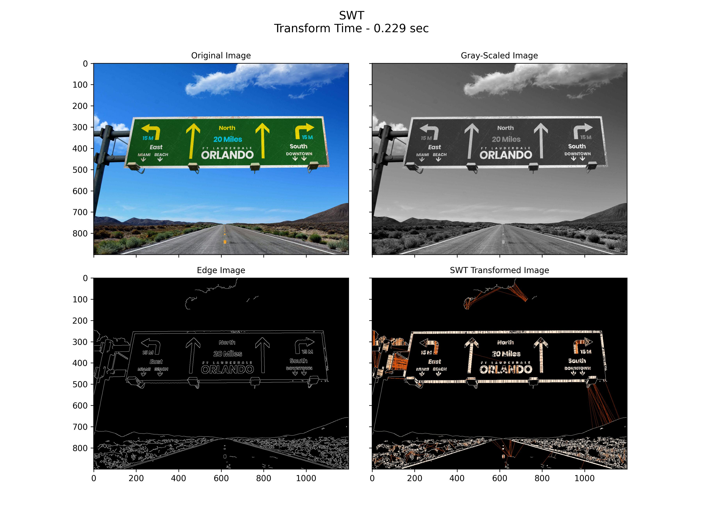

# SWTloc : Stroke Width Transform Text Localizer


[](https://pypi.org/project/swtloc/)
[](https://pypi.org/project/swtloc/)
[](https://pypi.org/project/swtloc/)

## Description

This repo contains a python implementation structured as a python package pertaining to the text localization method as in a natural image as outlayed in the Research Paper :- 

[Detecting Text in Natural Scenes with Stroke Width Transform.
Boris Epshtein, Eyal Ofek & Yonatan Wexler
(June, 2010)](https://www.microsoft.com/en-us/research/publication/detecting-text-in-natural-scenes-with-stroke-width-transform/)

<p style="text-align:center"></p>

This library extends the transformation stage of the image for textual content by giving the ability to :

- Localize `Letter`'s : through `SWTImage.localizeLetters`
- Localize `Words`'s, via fusing individual `Letter`'s : through `SWTImage.localizeWords`

The process flow of is depicted in the image below : 


****
### Installation 
```py
pip install swtloc
```

****
## Speed Benchmarking
Below is the speed comparison between different versions of ``SWTLoc`` and their various engines. The time measured for
each test image was calculated based on 10 iterations of 10 runs each. Test Images can be found in ``examples/images/``
folder in this repository, and the code for generating the below table can be found in - 
[Improvements-in-v2.0.0.ipynb](examples/Improvements-in-v2.0.0.ipynb) notebook in ``examples/`` folder.

Test Image | SWT v1.1.1 (Python) | SWT v1.1.1 (Python) [x] | SWT v2.0.0 (Python) | SWT v2.0.0 (Python) [x] | SWT v2.0.0 (numba) | SWT v2.0.0 (numba) [x]
--- | --- | --- | --- |--- |--- |--- 
test_img1.jpg | 16.929 seconds| 1.0x| 8.145 seconds| 2.078x| 0.33 seconds| 51.315x
test_img2.jpg | 10.107 seconds| 1.0x| 4.205 seconds| 2.404x| 0.678 seconds| 50.904x
test_img3.jpg | 4.545 seconds| 1.0x| 2.701 seconds| 1.683x| 0.082 seconds| 55.625x
test_img4.jpeg | 7.626 seconds| 1.0x| 3.992 seconds| 1.91x| 0.142 seconds| 53.859x
test_img5.jpg | 17.071 seconds| 1.0x| 7.554 seconds| 2.26x| 0.302 seconds| 56.62x
test_img6.jpg | 4.973 seconds| 1.0x| 3.104 seconds| 1.602x| 0.094 seconds| 53.076x

****
## Frequently Used Code Snippets
### Performing Stroke Width Transformation
```python
# Installation
# !pip install swtloc

# Imports
import swtloc as swt
from swtloc.configs import (IMAGE_ORIGINAL,
                            IMAGE_GRAYSCALE,
                            IMAGE_EDGED,
                            IMAGE_SWT_TRANSFORMED)
# Image Path
imgpath = 'examples/images/test_image_5/test_img5.jpg'
# Result Path
respath = 'examples/images/test_image_5/usage_results/'
# Initializing the SWTLocalizer class with the image path
swtl = swt.SWTLocalizer(image_paths=imgpath)
# Accessing the SWTImage Object which is housing this image
swtImgObj = swtl.swtimages[0]
# Performing Stroke Width Transformation
swt_mat = swtImgObj.transformImage(text_mode='db_lf')
```


### Localizing & Annotating Letters and Generating Crops of Letters
```python
# Installation
# !pip install swtloc

# Imports
import swtloc as swt
from cv2 import cv2
from swtloc.configs import (IMAGE_ORIGINAL,
                            IMAGE_GRAYSCALE,
                            IMAGE_EDGED,
                            IMAGE_SWT_TRANSFORMED)
# Image Path
imgpath = 'examples/images/test_image_1/test_img1.jpg'
# Read the image
img = cv2.imread(imgpath)
# Result Path
respath = 'examples/images/test_image_1/usage_results/'
# Initializing the SWTLocalizer class with a pre loaded image
swtl = swt.SWTLocalizer(images=img)
swtImgObj = swtl.swtimages[0]
# Perform Stroke Width Transformation
swt_mat = swtImgObj.transformImage(text_mode='db_lf',
                                   maximum_angle_deviation=np.pi/2,
                                   gaussian_blurr_kernel=(11, 11),
                                   minimum_stroke_width=5,
                                   maximum_stroke_width=50,
                                   display=False)  # NOTE: Set display=True 
# Localizing Letters
localized_letters = swtImgObj.localizeLetters(minimum_pixels_per_cc=950,
                                              maximum_pixels_per_cc=5200)
letter_labels = [int(k) for k in list(localized_letters.keys())]
```


```python
# Some Other Helpful Letter related functions
# # Query a single letter
loc_letter, swt_loc, orig_loc = swtImgObj.getLetter(key=letter_labels[5])

# # Iterating over all the letters
# # Specifically useful for jupyter notebooks - Iterate over all
# # the letters, at the same time visualizing the localizations
letter_gen = swtImgObj.letterIterator()
loc_letter, swt_loc, orig_loc = next(letter_gen)

# # Generating a crop of a single letter on any of the available
# # image codes.
# # Crop on SWT Image
swtImgObj.saveCrop(save_path=respath,crop_of='letters',crop_key=6, crop_on=IMAGE_SWT_TRANSFORMED, crop_type='min_bbox')
# # Crop on Original Image
swtImgObj.saveCrop(save_path=respath,crop_of='letters',crop_key=6, crop_on=IMAGE_ORIGINAL, crop_type='min_bbox')
```

### Localizing & Annotating Words and Generating Crops of Words
```python
# Installation
# !pip install swtloc
# Imports
import swtloc as swt
from cv2 import cv2
from swtloc.configs import (IMAGE_ORIGINAL,
                            IMAGE_GRAYSCALE,
                            IMAGE_EDGED,
                            IMAGE_SWT_TRANSFORMED)
# Image Path
imgpath = 'images/test_img2/test_img2.jpg'
# Result Path
respath = 'images/test_img2/usage_results/'
# Initializing the SWTLocalizer class with the image path
swtl = swt.SWTLocalizer(image_paths=imgpath)
swtImgObj = swtl.swtimages[0]
# Perform Stroke Width Transformation
swt_mat = swtImgObj.transformImage(maximum_angle_deviation=np.pi/2,
                                   gaussian_blurr_kernel=(9, 9),
                                   minimum_stroke_width=3,
                                   maximum_stroke_width=50,
                                   include_edges_in_swt=False,
                                   display=False)  # NOTE: Set display=True 

# Localizing Letters
localized_letters = swtImgObj.localizeLetters(minimum_pixels_per_cc=400,
                                              maximum_pixels_per_cc=6000,
                                              display=False)  # NOTE: Set display=True 

# Calculate and Draw Words Annotations
localized_words = swtImgObj.localizeWords(display=True)  # NOTE: Set display=True 
word_labels = [int(k) for k in list(localized_words.keys())]
```


```python
# Some Other Helpful Words related functions
# # Query a single word
loc_word, swt_loc, orig_loc = swtImgObj.getWord(key=word_labels[8])

# # Iterating over all the words
# # Specifically useful for jupyter notebooks - Iterate over all
# # the words, at the same time visualizing the localizations
word_gen = swtImgObj.wordIterator()
loc_word, swt_loc, orig_loc = next(word_gen)

# # Generating a crop of a single word on any of the available
# # image codes
# # Crop on SWT Image
swtImgObj.saveCrop(save_path=respath, crop_of='words', crop_key=9, crop_on=IMAGE_SWT_TRANSFORMED, crop_type='bubble')
# # Crop on Original Image
swtImgObj.saveCrop(save_path=respath, crop_of='words', crop_key=9, crop_on=IMAGE_ORIGINAL, crop_type='bubble')
```

****
### For Usage :
- [Usage.md](Usage.md)
- [SWTloc-Usage-[v2.0.0-onwards].ipynb](examples/SWTloc-Usage-[v2.0.0-onwards].ipynb) in ``examples/`` folder.

****
### For History Logs 
- [History.md](History.md)
