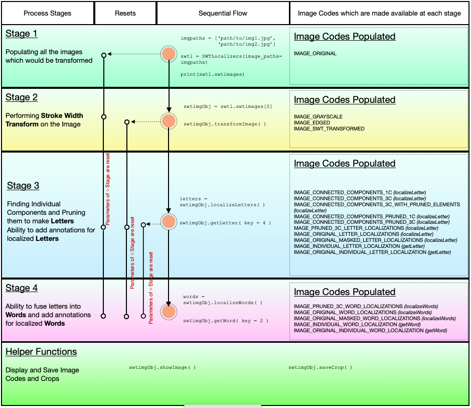

# SWTloc : Stroke Width Transform Text Localizer


[](https://pypi.org/project/swtloc/)
[](https://pypi.org/project/swtloc/)
[](https://pypi.org/project/swtloc/)
[](https://swtloc.readthedocs.io/en/latest/?badge=latest)

## Description

This repo contains a python implementation structured as a python package pertaining to the text localization method as in a natural image as outlayed in the Research Paper :- 

[Detecting Text in Natural Scenes with Stroke Width Transform.
Boris Epshtein, Eyal Ofek & Yonatan Wexler
(June, 2010)](https://www.microsoft.com/en-us/research/publication/detecting-text-in-natural-scenes-with-stroke-width-transform/)

<p style="text-align:center"></p>

This library extends the transformation stage of the image for textual content by giving the ability to :

- Localize `Letter`'s : through `SWTImage.localizeLetters`
- Localize `Words`'s, via fusing individual `Letter`'s : through `SWTImage.localizeWords`

The process flow of is depicted in the image below : 



****
## Installation
To install `swtloc`, simply : 
```py
pip install swtloc
```

****
## Speed Benchmarking
Below is the speed comparison between different versions of ``SWTLoc`` and their various engines. The time measured for
each test image was calculated based on 10 iterations of 10 runs each. Test Images can be found in ``examples/images/``
folder in this repository, and the code for generating the below table can be found in - 
[Improvements-in-v2.0.0.ipynb](../examples/Improvements-in-v2.0.0.ipynb) notebook in ``examples/`` folder.

Test Image | SWT v1.1.1 (Python) | SWT v1.1.1 (Python) [x] | SWT v2.0.0 (Python) | SWT v2.0.0 (Python) [x] | SWT v2.0.0 (numba) | SWT v2.0.0 (numba) [x]
--- | --- | --- | --- |--- |--- |--- 
test_img1.jpg | 16.929 seconds| 1.0x| 8.145 seconds| 2.078x| 0.33 seconds| 51.315x
test_img2.jpg | 10.107 seconds| 1.0x| 4.205 seconds| 2.404x| 0.678 seconds| 50.904x
test_img3.jpg | 4.545 seconds| 1.0x| 2.701 seconds| 1.683x| 0.082 seconds| 55.625x
test_img4.jpeg | 7.626 seconds| 1.0x| 3.992 seconds| 1.91x| 0.142 seconds| 53.859x
test_img5.jpg | 17.071 seconds| 1.0x| 7.554 seconds| 2.26x| 0.302 seconds| 56.62x
test_img6.jpg | 4.973 seconds| 1.0x| 3.104 seconds| 1.602x| 0.094 seconds| 53.076x

****
