# Usage 
These code blocks can be found in [SWTloc-Usage-[v2.0.0-onwards].ipynb](examples/SWTloc-Usage-[v2.0.0-onwards].ipynb)
notebook in `examples/`.

## Initialisation of ``SWTLocalizer``
- Initialising the  - This is the entry point, which can accept either single image path (str)/
multiple image paths (List[str])/ single image (np.ndarray)/ multiple images (List[np.ndarray]).
```py
from swtloc import SWTLocalizer
imgpath = 'images/test_img4/test_img4.jpeg'
respath = 'images/test_img4/usage_results/'
swtl = SWTLocalizer(image_paths=imgpath)
swtImgObj = swtl.swtimages[0]
print(swtImgObj, type(swtImgObj))
swtImgObj.showImage()
```
> SWTImage-test_img4 <class 'swtloc.abstractions.SWTImage'>

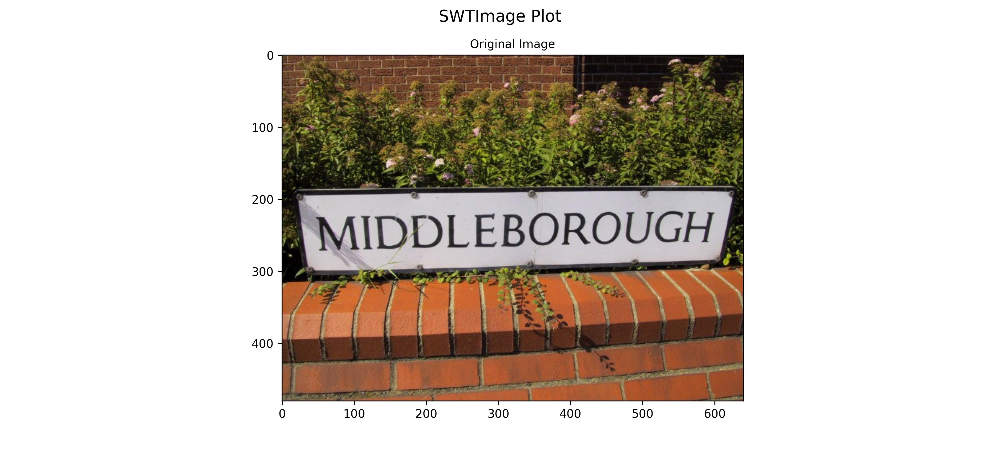

## Stroke Width Transformation using ``SWTImage.transformImage``
```py
swt_mat = swtImgObj.transformImage(text_mode='lb_df',
                                   auto_canny_sigma=1.0,
                                   maximum_stroke_width=20)
```
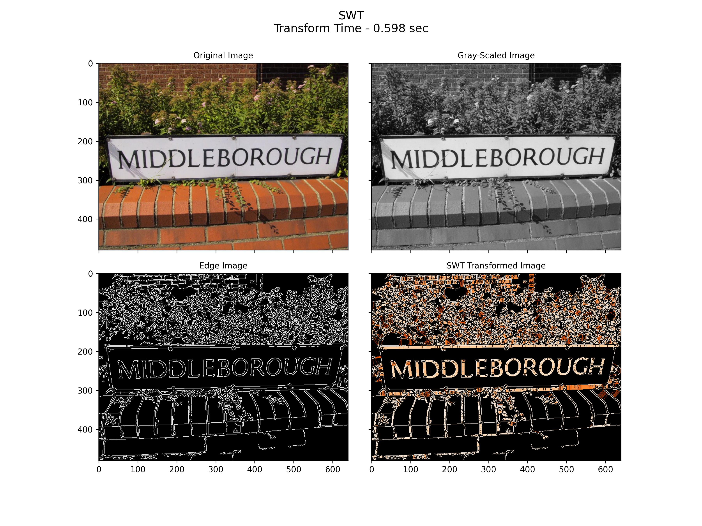

## Localizing Letters using ``SWTImage.localizeLetters``
```py
localized_letters = swtImgObj.localizeLetters(minimum_pixels_per_cc=100,
                                              maximum_pixels_per_cc=10_000,
                                              acceptable_aspect_ratio=0.2)
letter_labels = list([int(k) for k in localized_letters.keys()])
```
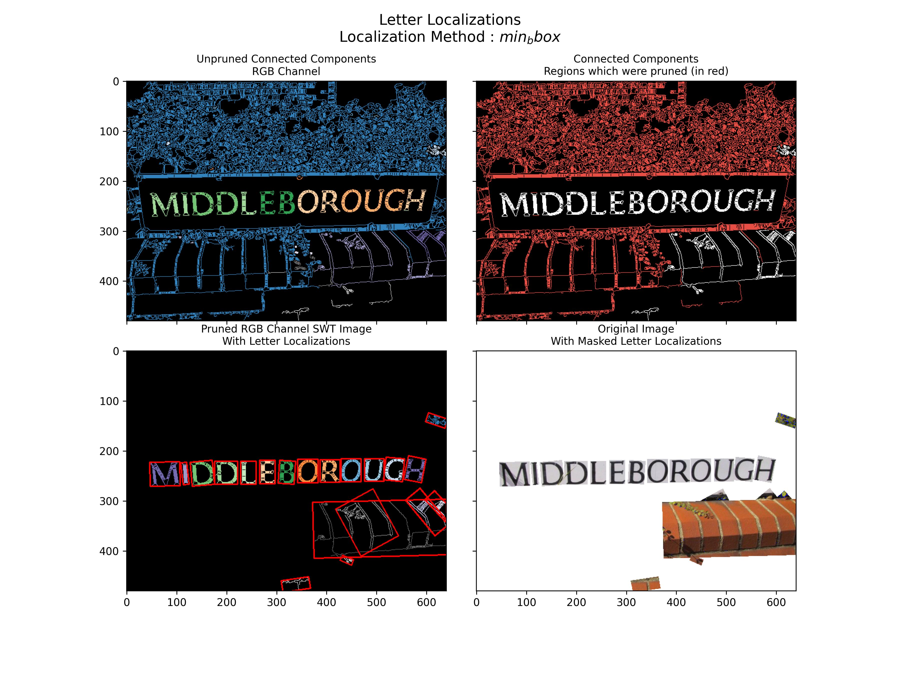

## Query a Letter using ``SWTImage.getLetter``
```py
letter_label = letter_labels[3]
locletter = swtImgObj.getLetter(key=letter_label)
```
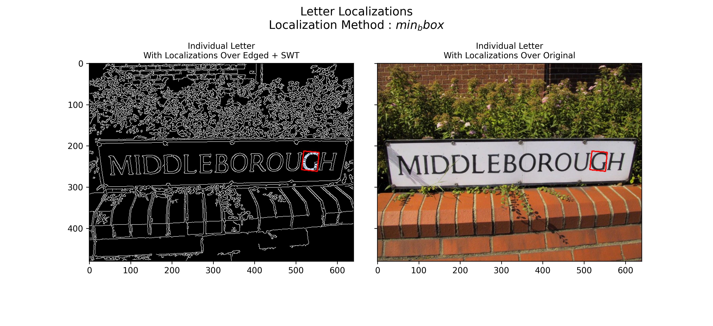

## Localizing Letters using ``SWTImage.localizeWords``
```py
localized_words = swtImgObj.localizeWords()
word_labels = list([int(k) for k in localized_words.keys()])
```
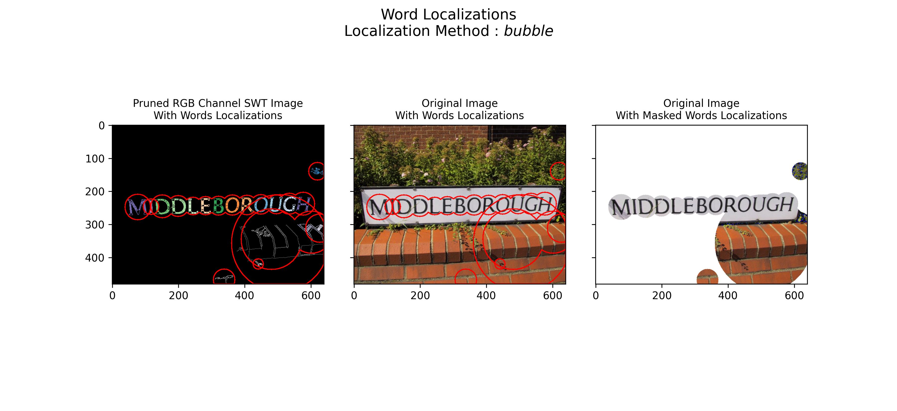

## Query a Word using ``SWTImage.getWord``
```py
word_label = word_labels[12]
locword = swtImgObj.getWord(key=word_label)
```
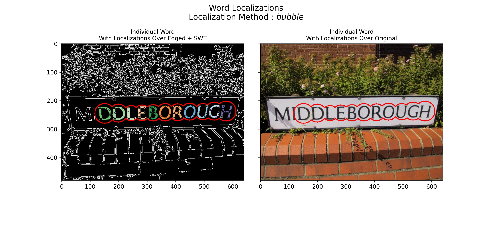

## Accessing intermediary stage images using ``SWTImage.showImage`` and saving them
```py
from swtloc.configs import (IMAGE_ORIGINAL,
                            IMAGE_ORIGINAL_MASKED_WORD_LOCALIZATIONS)
swtImgObj.showImage(image_codes=[IMAGE_ORIGINAL,
                                 IMAGE_ORIGINAL_MASKED_WORD_LOCALIZATIONS],
                    plot_title='Original & Bubble Mask')
```
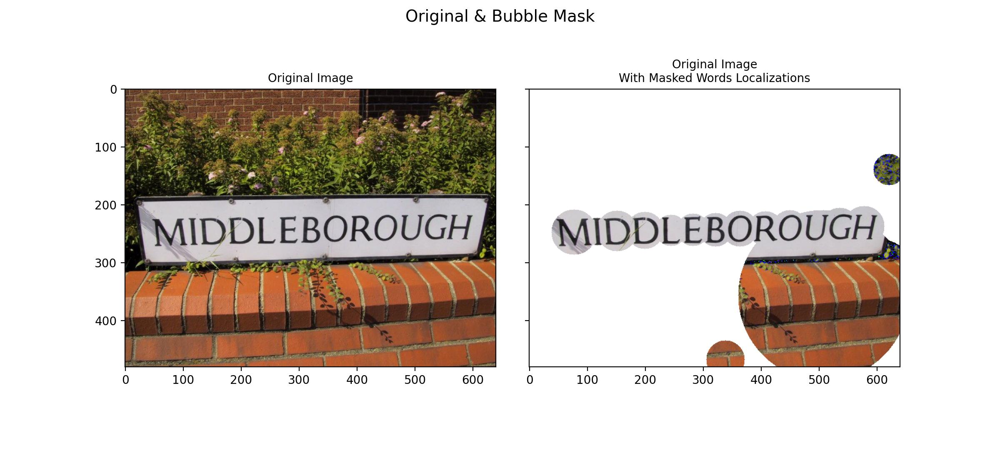


## Saving Crops of the localized letters and words
```py
from swtloc.configs import (IMAGE_ORIGINAL,
                            IMAGE_SWT_TRANSFORMED)
# Letter Crops
swtImgObj.saveCrop(save_path=respath, crop_of='letters', crop_key=4, crop_type='min_bbox', crop_on=IMAGE_ORIGINAL)
swtImgObj.saveCrop(save_path=respath, crop_of='letters', crop_key=4, crop_type='min_bbox', crop_on=IMAGE_SWT_TRANSFORMED)

# Word Crops
swtImgObj.saveCrop(save_path=respath, crop_of='words', crop_key=13, crop_type='bubble', crop_on=IMAGE_ORIGINAL)
swtImgObj.saveCrop(save_path=respath, crop_of='words', crop_key=13, crop_type='bubble', crop_on=IMAGE_SWT_TRANSFORMED)
```
> Letter Crops
<p align="middle" title="Letter Crops">
  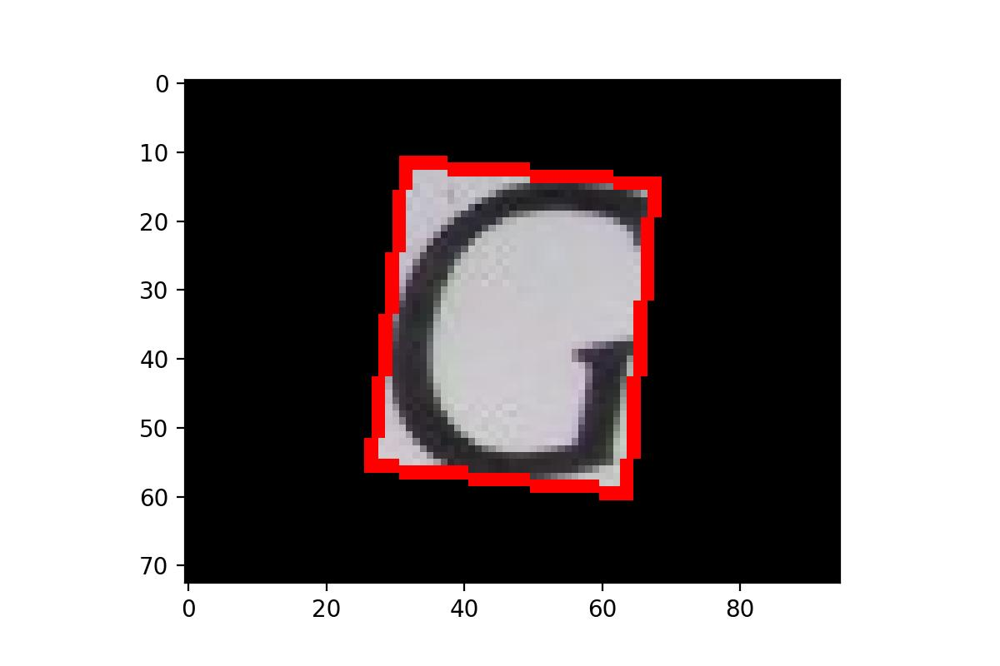
  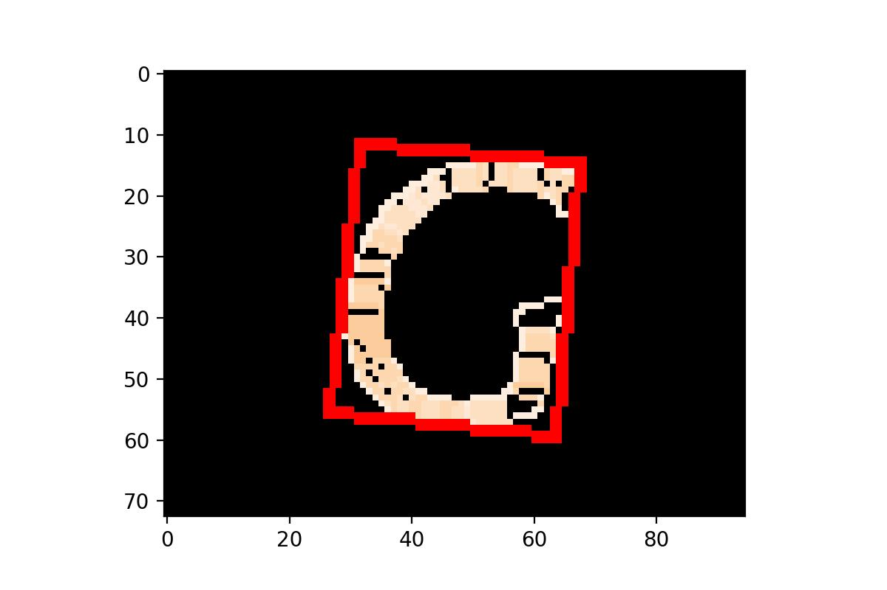 
</p>

> Word Crops
<p align="middle" title="Word Crops">
  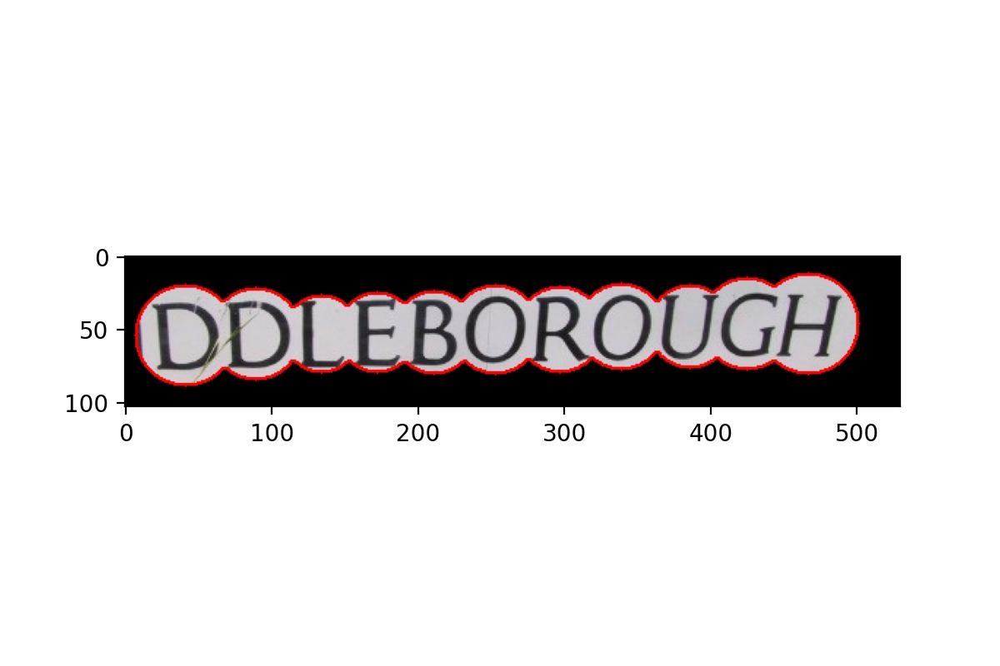
  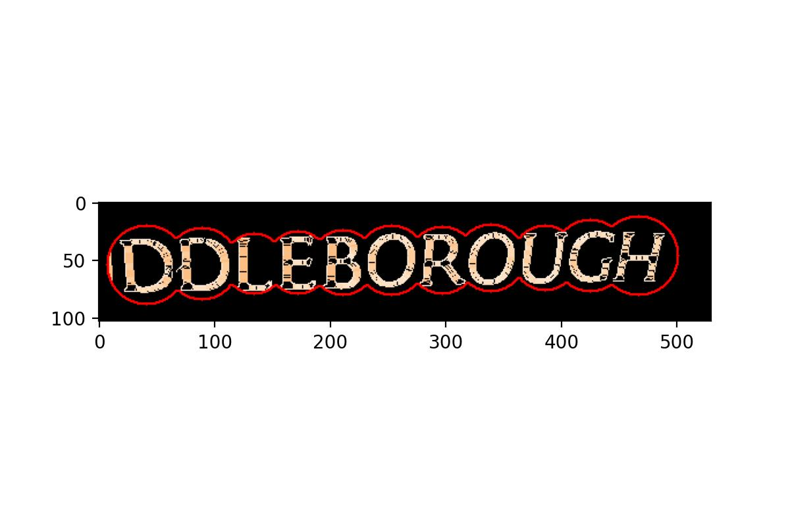 
</p>
