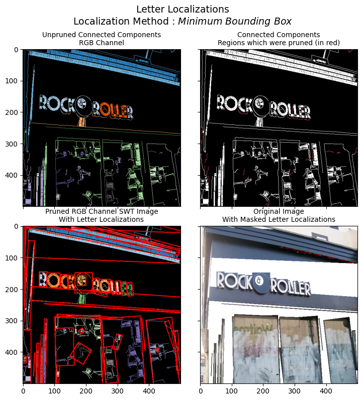
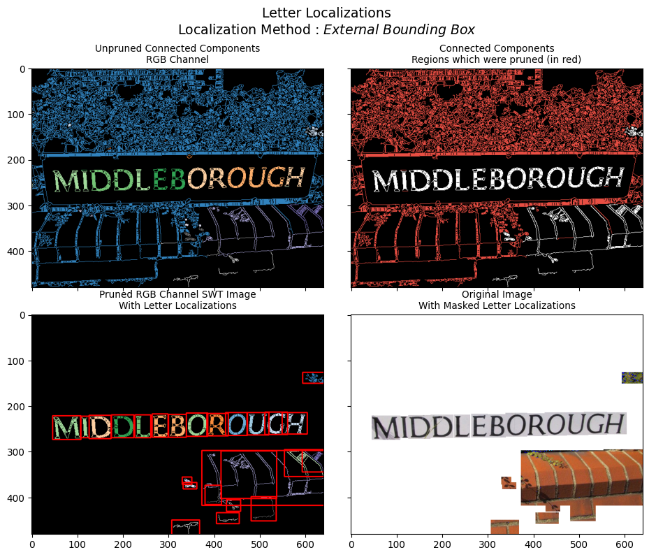
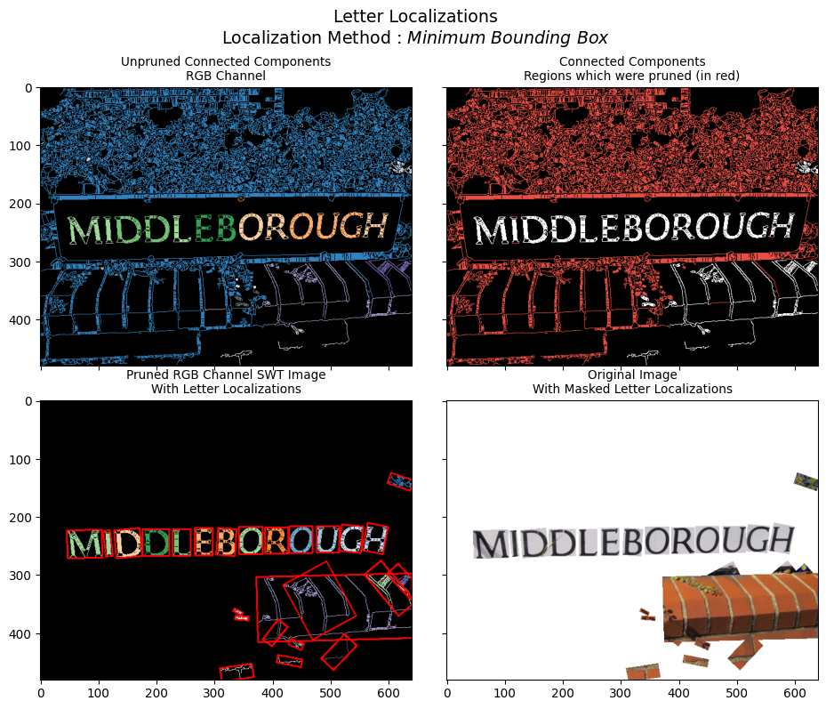

```python
import os
import numpy as np
import numba as nb
import pandas as pd
from cv2 import cv2
import swtloc as swt
from platform import python_version
```

```python
from swtloc import SWTLocalizer
from swtloc.configs import (IMAGE_ORIGINAL,
                            IMAGE_GRAYSCALE,
                            IMAGE_EDGED,
                            IMAGE_SWT_TRANSFORMED,
                            IMAGE_CONNECTED_COMPONENTS_1C,
                            IMAGE_CONNECTED_COMPONENTS_3C,
                            IMAGE_CONNECTED_COMPONENTS_3C_WITH_PRUNED_ELEMENTS,
                            IMAGE_CONNECTED_COMPONENTS_PRUNED_1C,
                            IMAGE_CONNECTED_COMPONENTS_PRUNED_3C,
                            IMAGE_PRUNED_3C_LETTER_LOCALIZATIONS,
                            IMAGE_ORIGINAL_LETTER_LOCALIZATIONS,
                            IMAGE_ORIGINAL_MASKED_LETTER_LOCALIZATIONS,
                            IMAGE_PRUNED_3C_WORD_LOCALIZATIONS,
                            IMAGE_ORIGINAL_WORD_LOCALIZATIONS,
                            IMAGE_ORIGINAL_MASKED_WORD_LOCALIZATIONS,
                            IMAGE_INDIVIDUAL_LETTER_LOCALIZATION,
                            IMAGE_ORIGINAL_INDIVIDUAL_LETTER_LOCALIZATION,
                            IMAGE_INDIVIDUAL_WORD_LOCALIZATION,
                            IMAGE_ORIGINAL_INDIVIDUAL_WORD_LOCALIZATION)
from swtloc.utils import image_1C_to_3C
from swtloc.utils import show_N_images
from swtloc.configs import get_code_descriptions
from swtloc.configs import CODE_NAME_VAR_MAPPINGS
```

```python
rawimage_path = 'images/'
```

```python
img_paths = []
res_path = []
img_names = []
img_text_modes = ['db_lf', 'lb_df', 'db_lf', 'lb_df', 'db_lf', 'db_lf']

for each_img in [k for k in os.listdir(rawimage_path) if 'test' in k]:
    _ifolder_path = rawimage_path+each_img
    _iname = [k for k in os.listdir(_ifolder_path) if '.' in k][0]
    _img_path = _ifolder_path+'/'+_iname
    img_paths.append(_img_path)
    img_names.append(_iname)
    res_path.append(_ifolder_path+'/usage_results/')
```

## SWTLocalizer Class

`SWTLocalizer` class acts as an entry point for performing transformations to the images. It can accept
- Single Image Path
- Multiple Image Paths
- Single Pre-Loaded Image
- Multiple Pre-Loaded Images

Once the `SWTLocalizer` object is instantiated, the attribute `swtimages` will be populated with all the `SWTImage` objects corresponding to each input image.

<div class="alert alert-block alert-info">
<b>NOTE:</b> 
If the image array is provided through `images` parameter, image names are randomly generated and assigned. Image names are used while saving the results
</div>

**Instantiating `SWTLocalizer` with Mixed Input will raise an error**


```python
swtl = SWTLocalizer(images=[img_paths[0]]+[cv2.imread(img_paths[1])])
print(swtl.swtimages)
```


    ---------------------------------------------------------------------------

    SWTLocalizerValueError                    Traceback (most recent call last)

    Input In [5], in <module>
    ----> 1 swtl = SWTLocalizer(images=[img_paths[0]]+[cv2.imread(img_paths[1])])
          2 print(swtl.swtimages)
    

    File D:\Personal Stuff\swtloc-project\venvs\py39VenvDev\lib\site-packages\swtloc\swtlocalizer.py:173, in SWTLocalizer.__init__(self, multiprocessing, images, image_paths)
        170 self.swtimages: List[SWTImage] = []
        172 # Sanity Checks
    --> 173 res_pack = self._sanityChecks(images=images, image_paths=image_paths)
        174 transform_inputs, transform_input_flags, transform_input_image_names = res_pack
        176 # Instantiate each transform_input as SWTImage
    

    File D:\Personal Stuff\swtloc-project\venvs\py39VenvDev\lib\site-packages\swtloc\swtlocalizer.py:254, in SWTLocalizer._sanityChecks(images, image_paths)
        251 for each_image in images:
        252     # Check if all the elements in the list are images
        253     if not isinstance(each_image, np.ndarray):
    --> 254         raise SWTLocalizerValueError(
        255             "If a list is provided to `images`, each element should be an np.ndarray")
        256     # Check if its whether 3d or 1d image
        257     if not (len(each_image.shape) in [3, 2]):
    

    SWTLocalizerValueError: If a list is provided to `images`, each element should be an np.ndarray


**Instantiating `SWTLocalizer` with Single Pre-Loaded Image**


```python
single_image = cv2.imread(img_paths[0])
swtl = SWTLocalizer(images=single_image)
print(swtl.swtimages)
```

    [SWTImage-SWTImage_982112]
    

**Instantiating `SWTLocalizer` with Multiple Pre-Loaded Images**


```python
multiple_images = [cv2.imread(each_path) for each_path in img_paths]
swtl = SWTLocalizer(images=multiple_images)
print(swtl.swtimages)
```

    [SWTImage-SWTImage_982112, SWTImage-SWTImage_571388, SWTImage-SWTImage_866821, SWTImage-SWTImage_182401, SWTImage-SWTImage_241787, SWTImage-SWTImage_631871]
    

**Instantiating `SWTLocalizer` with Single Image Path**


```python
swtl = SWTLocalizer(image_paths=img_paths[0])
print(swtl.swtimages)
```

    [SWTImage-test_img1]
    

**Instantiating `SWTLocalizer` with Multiple Image Paths**


```python
swtl = SWTLocalizer(image_paths=img_paths)
print(swtl.swtimages)
```

    [SWTImage-test_img1, SWTImage-test_img2, SWTImage-test_img3, SWTImage-test_img4, SWTImage-test_img5, SWTImage-test_img6]
    

Once the `swtimages` attribute of the `SWTLocalizer` class has been populated with `SWTImage` object, to perform operations like *transforming*, *pruning*, *localization* etc, grab any of the prepared `SWTImage` object and access its functions for performing the said operations


```python
swtImgObj = swtl.swtimages[0]
swtImgObj
```

    SWTImage-test_img1

## SWT Transformation

This section is devoted to explaining the parameters which are available in the `SWTImage.transformImage` function

- [text_mode](#SWTImage.transform.text_mode)
- [engine](##SWTImage.transform.engine)
- [gaussian_blurr](#SWTImage.transform.gaussian_blurr)
- [gaussian_blurr_kernel](#SWTImage.transform.gaussian_blurr_kernel)
- [edge_function](#SWTImage.transform.edge_function)
- [auto_canny_sigma](#SWTImage.transform.auto_canny_sigma)
- [minimum_stroke_width](#SWTImage.transform.minimum_stroke_width)
- [maximum_stroke_width](#SWTImage.transform.maximum_stroke_width)
- [check_angle_deviation](#SWTImage.transform.check_angle_deviation)
- [maximum_angle_deviation](#SWTImage.transform.maximum_angle_deviation)
- [include_edges_in_swt](#SWTImage.transform.include_edges_in_swt)
- [display](#SWTImage.transform.display)

Image Codes which become available after running of `SWTImage.transfromImage` function

Image-Code | Description 
--- | --- | 
IMAGE_ORIGINAL   |  Original Image
IMAGE_GRAYSCALE   |  Gray-Scaled Image
IMAGE_EDGED   |  Edge Image
IMAGE_SWT_TRANSFORMED   |   SWT Transformed Image

**Our Muse (🐁) for this Section**


```python
swtImgObj0 = swtl.swtimages[0]
swtImgObj0.showImage()
```
    


### SWTImage.transform.text_mode
**Text Mode Parameter** [default = 'lb_df']

This is image specific, but an extremely important parameter that takes one of the two value :-
- db_lf :> **D**ark **B**ackground **L**ight **F**oreground i.e Light color text on Dark color background
- lb_df :> **L**ight **B**ackground **D**ark **F**oreground i.e Dark color text on Light color background

This parameters affect how the gradient vectors (the direction) are calulated, since gradient vectors of **db_lf** are in $-ve$ direction to that of **lb_df** gradient vectors

For the image below, the `text_mode` parameter must be "db_lf"


```python
swt_mat = swtImgObj0.transformImage(text_mode='db_lf')
```


    

    


If we were to use text_mode = 'lb_df' (*default value*) in the above image, the strokes would have been made in the direction opposite to what we would want : 


```python
swt_mat1 = swtImgObj0.transformImage(text_mode='db_lf', display=False)
swt_mat2 = swtImgObj0.transformImage(text_mode='lb_df', display=False)

show_N_images([image_1C_to_3C(swt_mat1),
               image_1C_to_3C(swt_mat2)],
              individual_titles=['db_lf', 'lb_df'],
              plot_title='Comparing text mode\n',
              sup_title=swtImgObj0.image_name)
```


    

    


For the image below, the `text_mode` parameter must be "lb_df"


```python
swtImgObj1 = swtl.swtimages[1]
swt_mat = swtImgObj1.transformImage(text_mode='lb_df')
swtImgObj1._resetSWTTransformParams()
```


    

    


### SWTImage.transform.engine
**Engine Parameter** [default='numba']

This parameter was added from v2.0.0 onwards, there are two available engines for stroke width transformation
- `engine`="numba" : Numba No-Python, jit compilation to compine the `findStrokes` function (in core.py) to machine code, hence enhancing the speed of transformation
- `engine`="python" : Vanilla Python

```python
%%timeit -n 10 -r 10
# Speed Benchmarking using numba engine
_=swtImgObj0.transformImage(text_mode='db_lf', display=False)
```
    232 ms ± 11.6 ms per loop (mean ± std. dev. of 10 runs, 10 loops each)

<div class="alert alert-block alert-info">
<b>NOTE:</b> 
This code block takes long to complete the run...
</div>


```python
%%timeit -n 10 -r 10
# Speed Benchmarking using python engine
_=swtImgObj0.transformImage(text_mode='db_lf', engine='python', display=False)
```
    5.33 s ± 159 ms per loop (mean ± std. dev. of 10 runs, 10 loops each)

Clearly, there is nearly 50x speed enhancement while using `engine`="numba", its also the default parameter. Also, while testing the same with other test images, similar speed improvements were found. You can find the Speed Benchmarking for other test images in `README.md`

### SWTImage.transform.gaussian_blurr
**Gaussian Blurr Parameter** [default = True]

Whether to apply gaussian blurr or not.

```python
swt_mat1 = swtImgObj0.transformImage(text_mode='db_lf', gaussian_blurr=True, display=False)
gs_time = swtImgObj0.transform_time
swt_mat2 = swtImgObj0.transformImage(text_mode='db_lf', gaussian_blurr=False, display=False)
nogs_time = swtImgObj0.transform_time

show_N_images([image_1C_to_3C(swt_mat1),
               image_1C_to_3C(swt_mat2)],
              individual_titles=[f'With Gaussian Blurr - {gs_time}', f'Without Gaussian Blurr - {nogs_time}'],
              plot_title='Comparing with & w/o Gaussian Blurr\n',
              sup_title=swtImgObj0.image_name)
```
    


### SWTImage.transform.gaussian_blurr_kernel
**Gaussian Blurr Kernel Parameter** [default = (5, 5)]

Kernel to use for gaussian blurring when `gaussian_blurr` parameter is set to True


```python
swt_mat1 = swtImgObj0.transformImage(text_mode='db_lf', gaussian_blurr=True,
                                     gaussian_blurr_kernel=(7, 7), display=False)
k1_time = swtImgObj0.transform_time
swt_mat2 = swtImgObj0.transformImage(text_mode='db_lf', gaussian_blurr=True,
                                     gaussian_blurr_kernel=(13, 13), display=False)
k2_time = swtImgObj0.transform_time

show_N_images([image_1C_to_3C(swt_mat1),
               image_1C_to_3C(swt_mat2)],
              individual_titles=[f'With Gaussian Blurr Kernel (7, 7) - {k1_time}',
                                 f'Without Gaussian Blurr Kernel (13, 13) - {k2_time}'],
              plot_title='Comparing with & w/o Gaussian Blurr\n',
              sup_title=swtImgObj0.image_name)
```


    

    


### SWTImage.transform.edge_function
**Image Edging** [default = 'ac']

Finding the Edge of the image is a tricky part, this is pertaining to the fact that in most of the cases the images we deal with are of not that standard that applying just a opencv Canny operator would result in the desired Edge Image.

Sometimes (In most cases) there is some custom processing required before edging, for that reason alone this function accepts one of the following two arguments :- 

- 'ac' :> Auto-Canny function, an in-built function which will generate the Canny Image from the original image, internally calculating the threshold parameters, although, to tune it even further 'ac_sigma' parameter is provided which can take any value between 0.0 <--> 1.0 .

- *A custom function* : This function should have its signature as mentioned below :

    def custom_edge_func(gauss_image):

        Your Function Logic...

        edge_image = ...
        
        return edge_image
    

**Comparing Auto Canny Sigma Values**

```python
def custom_edge_func(gray_image):
    gauss_image = cv2.GaussianBlur(gray_image, (5,5), 1)
    laplacian_conv = cv2.Laplacian(gauss_image, -1, (5,5))
    canny_edge = cv2.Canny(laplacian_conv, 20, 140)
    return canny_edge
```


```python
swt_mat1 = swtImgObj1.transformImage(edge_function=custom_edge_func, display=False)
cef_time = swtImgObj1.transform_time
swt_mat2 = swtImgObj1.transformImage(edge_function='ac', display=False)
ac_time = swtImgObj1.transform_time

show_N_images([image_1C_to_3C(swt_mat1),
               image_1C_to_3C(swt_mat2)],
              individual_titles=[f'With custom edge_function - {cef_time}',
                                 f'With auto canny edge function - {ac_time}'],
              plot_title='Comparing different method of edge detection\n',
              sup_title=swtImgObj1.image_name)
swtImgObj1._resetSWTTransformParams()
```


### SWTImage.transform.auto_canny_sigma
**Sigma Values of Auto Canny Edge Function** [default = 0.33]

Sigma value of the Auto Canny Edge function, only applicable when `edge_function` = "ac"

```python
swt_mat1 = swtImgObj0.transformImage(text_mode='db_lf', auto_canny_sigma=0.1, display=False)
acd_time = swtImgObj0.transform_time
swt_mat2 = swtImgObj0.transformImage(text_mode='db_lf', auto_canny_sigma=1.0, display=False)
ac1_time = swtImgObj0.transform_time

show_N_images([image_1C_to_3C(swt_mat1),
               image_1C_to_3C(swt_mat2)],
              individual_titles=[f'With edge_function=ac & sigma=0.10 - {acd_time}',
                                 f'With edge_function=ac & sigma=1.00 - {ac1_time}'],
              plot_title='Comparing different values of sigma for auto-canny\n',
              sup_title=swtImgObj.image_name)
```
    


### SWTImage.transform.include_edges_in_swt
**Parameter to include those edges from which no stroke was finalised** [default = True]

Not all edges end up generating an eligible strokes from them, this parameter gives an option whether to include those edges in or not. Edges hold the value=1 in the swt image

```python
swt_mat1 = swtImgObj0.transformImage(text_mode='db_lf', include_edges_in_swt=True,
                                     gaussian_blurr_kernel = (11, 11), display=False)
we_time = swtImgObj0.transform_time
swt_mat2 = swtImgObj0.transformImage(text_mode='db_lf', include_edges_in_swt=False,
                                     gaussian_blurr_kernel = (11, 11), display=False)
woe_time = swtImgObj0.transform_time

show_N_images([image_1C_to_3C(swt_mat1),
               image_1C_to_3C(swt_mat2)],
              individual_titles=[f'SWT With Edges - {we_time}',
                                 f'SWT w/o Edges - {woe_time}'],
              plot_title='Comparing with and without edges SWT\n',
              sup_title=swtImgObj0.image_name)
```
    


### SWTImage.transform.minimum_stroke_width
**Minimum Permissible Stroke Length Parameter** [default = 3]

While looking for a eligibile stroke emanating from any edge co-ordinate in the image, this parameter governs the minimum stroke length below which the stroke will be disqualified.


```python
swt_mat1 = swtImgObj0.transformImage(text_mode='db_lf', minimum_stroke_width=10,
                                     include_edges_in_swt=False, display=False)
acd_time = swtImgObj0.transform_time
swt_mat2 = swtImgObj0.transformImage(text_mode='db_lf', minimum_stroke_width=20,
                                     include_edges_in_swt=False, display=False)
ac1_time = swtImgObj0.transform_time
```

```python
np.unique(swt_mat1)
```

    array([  0,  10,  11,  12,  13,  14,  15,  16,  17,  18,  19,  20,  21,
            22,  23,  24,  25,  26,  27,  28,  29,  30,  31,  32,  33,  34,
            35,  36,  37,  38,  39,  40,  41,  42,  43,  44,  45,  46,  47,
            48,  49,  50,  51,  52,  53,  54,  55,  56,  57,  58,  59,  60,
            61,  62,  63,  64,  65,  66,  67,  68,  69,  70,  71,  72,  73,
            74,  75,  76,  77,  78,  79,  80,  81,  82,  83,  84,  85,  86,
            89,  91,  92,  93,  94,  95,  98, 100, 101, 102, 104, 106, 107,
           109, 110, 112, 113, 114, 115, 116, 118, 153, 175, 185])

```python
np.unique(swt_mat2)
```

    array([  0,  20,  21,  22,  23,  24,  25,  26,  27,  28,  29,  30,  31,
            32,  33,  34,  35,  36,  37,  38,  39,  40,  41,  42,  43,  44,
            45,  46,  47,  48,  49,  50,  51,  52,  53,  54,  55,  56,  57,
            58,  59,  60,  61,  62,  63,  64,  65,  66,  67,  68,  69,  70,
            71,  72,  73,  74,  75,  76,  77,  78,  79,  80,  81,  82,  83,
            84,  85,  86,  89,  91,  92,  93,  94,  95,  98, 100, 101, 102,
           104, 106, 107, 109, 110, 112, 113, 114, 115, 116, 118, 153, 175,
           185])


### SWTImage.transform.maximum_stroke_width
**Maximum Permissible Stroke Length Parameter** [default = 200]

While looking for a eligibile stroke emanating from any edge co-ordinate in the image, this parameter governs the maximum stroke length beyond which the stroke will be disqualified.


```python
swt_mat1 = swtImgObj0.transformImage(text_mode='db_lf', maximum_stroke_width=20, display=False)
acd_time = swtImgObj0.transform_time
swt_mat2 = swtImgObj0.transformImage(text_mode='db_lf', maximum_stroke_width=70, display=False)
ac1_time = swtImgObj0.transform_time

show_N_images([image_1C_to_3C(swt_mat1),
               image_1C_to_3C(swt_mat2)],
              individual_titles=[f'SWT Max Stroke Width = 20 - {we_time}',
                                 f'SWT Max Stroke Width = 70 - {woe_time}'],
              plot_title='Comparing with and without edges SWT\n',
              sup_title=swtImgObj0.image_name)
```


    

### SWTImage.transform.check_angle_deviation
**Whether to check for angle deviation** [default = True]

Let's take an edge point **E1**, from where we start to form a ray in the direction of the gradient vector, and after few steps that ray lands on another edge point **E2**. Now that we have found an edge point **E2** after having started from E1, how can we be sure that this edge point **E2** is of the same letter i.e how can we be sure that the ray is an eligible stroke?

For this, the deviation between the gradient vectors of edge point **E1** and **E2** are measured, this parameter `check_angle_deviation` governs whether to check that deviation. If set to `False`, the first edge point that ray ends up meeting will stop the ray generation process and that ray will become an eligible stroke.

If se to `True` it will be ensured, before locking in the stroke, that the gradient vector of **E2** is nearly 180 degrees. The *nearly* part in last statement is quantified by the parameter [maximum_angle_deviation](#SWTImage.transform.maximum_angle_deviation)


```python
swt_mat1 = swtImgObj0.transformImage(text_mode='db_lf', check_angle_deviation=True, display=False)
ad_time = swtImgObj0.transform_time
swt_mat2 = swtImgObj0.transformImage(text_mode='db_lf', check_angle_deviation=False, display=False)
wad_time = swtImgObj0.transform_time

show_N_images([image_1C_to_3C(swt_mat1),
               image_1C_to_3C(swt_mat2)],
              individual_titles=[f'SWT with check_angle_deviation - {ad_time}',
                                 f'SWT without check_angle_deviation - {wad_time}'],
              plot_title='Comparing with and without edges SWT\n',
              sup_title=swtImgObj0.image_name)
```


    

### SWTImage.transform.maximum_angle_deviation
**Acceptable angle deviation in the incoming edge point's gradient vector**[default = np.pi/6]


As explained in the [check_angle_deviation](#SWTImage.transform.check_angle_deviation), this parameter quantifies whats the acceptable deviation between the gradient angles of the **E1** and any other incoming **E2**.


```python
swt_mat1 = swtImgObj0.transformImage(text_mode='db_lf', maximum_angle_deviation=np.pi/8, display=False)
ad8_time = swtImgObj0.transform_time
swt_mat2 = swtImgObj0.transformImage(text_mode='db_lf', maximum_angle_deviation=np.pi/2, display=False)
ad2_time = swtImgObj0.transform_time

show_N_images([image_1C_to_3C(swt_mat1),
               image_1C_to_3C(swt_mat2)],
              individual_titles=[f'SWT with maximum_angle_deviation=np.pi/8 - {ad8_time}',
                                 f'SWT without maximum_angle_deviation=np.pi/2 - {ad2_time}'],
              plot_title='Comparing with and without edges SWT\n',
              sup_title=swtImgObj0.image_name)
```


### SWTImage.transform.display
This parameter just governs whether to display that particular stage's process. Its interpretation is same for all the functions in `SWTImage` class.


```python
swt_mat1 = swtImgObj0.transformImage(text_mode='db_lf', maximum_angle_deviation=np.pi/8, display=True)
```
    


## Letter Localizations, Annotations & Query

`SWTImage.localizeLetters` function is responsible for localizing letters based on the following parameters. Apart from localization this function also calculates and generates boundaries across each individual letters.


- [minimum_pixels_per_cc](#SWTImage.localizeLetters.minimum_pixels_per_cc)
- [maximum_pixels_per_cc](#SWTImage.localizeLetters.maximum_pixels_per_cc)
- [acceptable_aspect_ratio](#SWTImage.localizeLetters.acceptable_aspect_ratio)
- [localize_by](#SWTImage.localizeLetters.localize_by)
- [padding_pct](#SWTImage.localizeLetters.padding_pct)

Connected Components are found using OpenCV's `connectedComponentsWithStats` function, in which each pixel is grouped to a blob of pixels who share their borders. Once these components have been found, pruning is done based on three parameters as stated above and explained below.

After the pruning it is assumed, whatever components which remain are worthy of being called as `Letter`'s.

These are the Image Codes which become available after running of `SWTImage.localizeLetters` function :

Image-Code | Description
--- | --- |
IMAGE_CONNECTED_COMPONENTS_1C | Connected Components Single Channel
IMAGE_CONNECTED_COMPONENTS_3C | Connected Components RGB Channel
IMAGE_CONNECTED_COMPONENTS_3C_WITH_PRUNED_ELEMENTS | Connected Components Regions which were pruned (in red)
IMAGE_CONNECTED_COMPONENTS_PRUNED_1C | Pruned Connected Components Single Channel
IMAGE_CONNECTED_COMPONENTS_PRUNED_3C | Pruned Connected Components RGB Channel
IMAGE_PRUNED_3C_LETTER_LOCALIZATIONS | Pruned RGB Channel SWT Image With Letter Localizations
IMAGE_ORIGINAL_LETTER_LOCALIZATIONS | Original Image With Letter Localizations
IMAGE_ORIGINAL_MASKED_LETTER_LOCALIZATIONS | Original Image With Masked Letter Localizations

**Our Muse (🐁) for this Section**

```python
swtImgObj1 = swtl.swtimages[1]
swtImgObj1.showImage()
```
    


**Transformation**

```python
swt_mat = swtImgObj1.transformImage(text_mode='lb_df',
                                    maximum_angle_deviation=np.pi/4, 
                                    include_edges_in_swt=True)
```
    


### SWTImage.localizeLetters.minimum_pixels_per_cc

All those connected components whose area(number of pixels in that connected component) is less than `minimum_pixels_per_cc` will be pruned

```python
localized_letters = swtImgObj1.localizeLetters()
```


```python
localized_letters = swtImgObj1.localizeLetters(minimum_pixels_per_cc=9000)
```


### SWTImage.localizeLetters.maximum_pixels_per_cc

All those connected components whose area(number of pixels in that connected component) is more than `maximum_pixels_per_cc` will be pruned

```python
localized_letters = swtImgObj1.localizeLetters(maximum_pixels_per_cc=3_000)
```


```python
localized_letters = swtImgObj1.localizeLetters(maximum_pixels_per_cc=5_000)
```
    


### SWTImage.localizeLetters.acceptable_aspect_ratio

All those connected components whose aspect ratio (width/height) is less than `acceptable_aspect_ratio` will be pruned

```python
swtImgObj2 = swtl.swtimages[2]
swt_mat = swtImgObj2.transformImage(text_mode='db_lf',
                                    maximum_stroke_width=30,
                                    maximum_angle_deviation=np.pi/8)
```


```python
localized_letters = swtImgObj2.localizeLetters(acceptable_aspect_ratio=0.5)
```


```python
localized_letters = swtImgObj2.localizeLetters(acceptable_aspect_ratio=0.005)
```



### SWTImage.localizeLetters.localize_by

There are three possible parameters which can be given to this function
- min_bbox : Minimum Bounding Box Boundary calculation & annotation 
- ext_bbox : Extreme Bounding Box Boundary calculation & annotation
- outline : Outline (Contour) Boundary calculation & annotation

```python
localized_letters = swtImgObj2.localizeLetters(localize_by='min_bbox')
```


```python
localized_letters = swtImgObj2.localizeLetters(localize_by='ext_bbox')
```


```python
localized_letters = swtImgObj2.localizeLetters(localize_by='outline')
```


### SWTImage.localizeLetters.padding_pct

While annotating, sometimes the annotation are quite tightly packed to the component itself, `padding_pct` will inflate the boundary which are calculated. This parameter is only applicable for `min_bbox` and `ext_bbox` localizations

```python
localized_letters = swtImgObj2.localizeLetters()
```


```python
localized_letters = swtImgObj2.localizeLetters(padding_pct=0.1)
```


## Word Localization, Annotations & Query

After having the letters localizer, there exists a core class `Fusion` whose job is to group individual components into `Words`, comparing aspects like :

- Proximity of letters to each other
- Relative minimum bounding box rotation angle from each other
- Deviation in color between from one component to the other
- Ratio of stroke widths from one to the other
- Ratio of minimum bounding box height of one to the other

The above comparisions are taken care of by the following parameters :

- [localize_by](#SWTImage.localizeWords.localize_by)
- [lookup_radius_multiplier]
- [acceptable_stroke_width_ratio]
- [acceptable_color_deviation]
- [acceptable_height_ratio]
- [acceptable_angle_deviation]
- [polygon_dilate_iterations]
- [polygon_dilate_kernel]


Image-Code | Description 
--- | --- | 
IMAGE_PRUNED_3C_WORD_LOCALIZATIONS | Pruned RGB Channel SWT Image With Words Localizations
IMAGE_ORIGINAL_WORD_LOCALIZATIONS | Original Image With Words Localizations
IMAGE_ORIGINAL_MASKED_WORD_LOCALIZATIONS | Original Image With Masked Words Localizations

<div class="alert alert-block alert-info">
<b>NOTE:</b> 
For `SWTImage.localizeWords` to run, it is required that `SWTImage.localizeLetters` has already been run with `localize_by` parameter set to "min_bbox"
</div>

**Our Muse (🐁) for this Section**

```python
swtImgObj3 = swtl.swtimages[3]
swtImgObj3.showImage()
```


**Applying Transformations**

```python
swt_mat = swtImgObj3.transformImage(auto_canny_sigma=1.0,
                                    minimum_stroke_width=3,
                                    maximum_stroke_width=20,
                                    maximum_angle_deviation=np.pi/6)
```


**Localizing Letters**

```python
# Localising Letters
localized_letters = swtImgObj3.localizeLetters(localize_by='ext_bbox')
```



**SWTImageProcess Error will be raised if `.localizeLetters(localize_by='min_bbox')`** hasnt been run already, as the properties which are calculated while localzing letters by `min_bbox` such as the min_bbox circum radius are required to fuse letters into words.

```python
# Localising Letters
localized_letters = swtImgObj3.localizeWords()
```

    ---------------------------------------------------------------------------

    SWTImageProcessError                      Traceback (most recent call last)

    Input In [48], in <module>
          1 # Localising Letters
    ----> 2 localized_letters = swtImgObj3.localizeWords()
    

    File D:\Personal Stuff\swtloc-project\venvs\py39VenvDev\lib\site-packages\swtloc\abstractions.py:1158, in SWTImage.localizeWords(self, localize_by, lookup_radius_multiplier, acceptable_stroke_width_ratio, acceptable_color_deviation, acceptable_height_ratio, acceptable_angle_deviation, polygon_dilate_iterations, polygon_dilate_kernel, display)
       1154 # TODO : Add the functionality to detect whether the changes were made to the
       1155 # TODO : localizations parameters or just annotation parameter and accordingly make the resets.
       1156 # Check if transform stage has been run first or not
       1157 if not self.letter_min_done:
    -> 1158     raise SWTImageProcessError(
       1159         "`SWTImage.localizeLetters` with localize_by='min_bbox' must be called before this function")
       1160 # Update configs & Initialise
       1161 self.cfg[CONFIG__SWTIMAGE__LOCALIZEWORDS_LOCALIZE_BY] = localize_by
    

    SWTImageProcessError: `SWTImage.localizeLetters` with localize_by='min_bbox' must be called before this function


```python
# Solution : Run .localizeLetters default localize_by = 'min_bbox' (default) 
# before running .localizeWords
localized_letters = swtImgObj3.localizeLetters()
```



### SWTImage.localizeWords.localize_by
**This parameter switches between various annotations which can be added to the words** [default = 'bubble']

Possible values are :
- 'bubble' : Bubble Boundary
- 'bbox' : Bounding Box
- 'polygon' : Contour Boundary

```python
localized_words = swtImgObj3.localizeWords(localize_by='bubble')
```


```python
localized_words = swtImgObj3.localizeWords(localize_by='bbox')
```


```python
localized_words = swtImgObj3.localizeWords(localize_by='polygon')
```


### Display Intermediary Images

From v2.0.0 onwards, a provision was added to save the intermediary stage images by access the `SWTImage.showImage` function. 

**Available Image Codes**

```python
image_code_df = pd.DataFrame(columns=['Description'])

for each_code_name, each_code in CODE_NAME_VAR_MAPPINGS.items():
    image_code_df.loc[each_code_name] = get_code_descriptions(each_code).replace('\n', ' ')
image_code_df.style.set_properties(**{'width': '600px', 'text-align': 'center'})
```

<style type="text/css">
#T_7921c_row0_col0, #T_7921c_row1_col0, #T_7921c_row2_col0, #T_7921c_row3_col0, #T_7921c_row4_col0, #T_7921c_row5_col0, #T_7921c_row6_col0, #T_7921c_row7_col0, #T_7921c_row8_col0, #T_7921c_row9_col0, #T_7921c_row10_col0, #T_7921c_row11_col0, #T_7921c_row12_col0, #T_7921c_row13_col0, #T_7921c_row14_col0, #T_7921c_row15_col0, #T_7921c_row16_col0, #T_7921c_row17_col0, #T_7921c_row18_col0 {
  width: 600px;
  text-align: center;
}
</style>
<table id="T_7921c">
  <thead>
    <tr>
      <th class="blank level0" >&nbsp;</th>
      <th id="T_7921c_level0_col0" class="col_heading level0 col0" >Description</th>
    </tr>
  </thead>
  <tbody>
    <tr>
      <th id="T_7921c_level0_row0" class="row_heading level0 row0" >IMAGE_ORIGINAL</th>
      <td id="T_7921c_row0_col0" class="data row0 col0" >Original Image</td>
    </tr>
    <tr>
      <th id="T_7921c_level0_row1" class="row_heading level0 row1" >IMAGE_GRAYSCALE</th>
      <td id="T_7921c_row1_col0" class="data row1 col0" >Gray-Scaled Image</td>
    </tr>
    <tr>
      <th id="T_7921c_level0_row2" class="row_heading level0 row2" >IMAGE_EDGED</th>
      <td id="T_7921c_row2_col0" class="data row2 col0" >Edge Image</td>
    </tr>
    <tr>
      <th id="T_7921c_level0_row3" class="row_heading level0 row3" >IMAGE_SWT_TRANSFORMED</th>
      <td id="T_7921c_row3_col0" class="data row3 col0" >SWT Transformed Image</td>
    </tr>
    <tr>
      <th id="T_7921c_level0_row4" class="row_heading level0 row4" >IMAGE_CONNECTED_COMPONENTS_1C</th>
      <td id="T_7921c_row4_col0" class="data row4 col0" >Unpruned Connected Components Single Channel</td>
    </tr>
    <tr>
      <th id="T_7921c_level0_row5" class="row_heading level0 row5" >IMAGE_CONNECTED_COMPONENTS_3C</th>
      <td id="T_7921c_row5_col0" class="data row5 col0" >Unpruned Connected Components RGB Channel</td>
    </tr>
    <tr>
      <th id="T_7921c_level0_row6" class="row_heading level0 row6" >IMAGE_CONNECTED_COMPONENTS_3C_WITH_PRUNED_ELEMENTS</th>
      <td id="T_7921c_row6_col0" class="data row6 col0" >Connected Components Regions which were pruned (in red)</td>
    </tr>
    <tr>
      <th id="T_7921c_level0_row7" class="row_heading level0 row7" >IMAGE_CONNECTED_COMPONENTS_PRUNED_1C</th>
      <td id="T_7921c_row7_col0" class="data row7 col0" >Pruned Connected Components Single Channel</td>
    </tr>
    <tr>
      <th id="T_7921c_level0_row8" class="row_heading level0 row8" >IMAGE_CONNECTED_COMPONENTS_PRUNED_3C</th>
      <td id="T_7921c_row8_col0" class="data row8 col0" >Pruned Connected Components RGB Channel</td>
    </tr>
    <tr>
      <th id="T_7921c_level0_row9" class="row_heading level0 row9" >IMAGE_PRUNED_3C_LETTER_LOCALIZATIONS</th>
      <td id="T_7921c_row9_col0" class="data row9 col0" >Pruned RGB Channel SWT Image With Letter Localizations</td>
    </tr>
    <tr>
      <th id="T_7921c_level0_row10" class="row_heading level0 row10" >IMAGE_ORIGINAL_LETTER_LOCALIZATIONS</th>
      <td id="T_7921c_row10_col0" class="data row10 col0" >Original Image With Letter Localizations</td>
    </tr>
    <tr>
      <th id="T_7921c_level0_row11" class="row_heading level0 row11" >IMAGE_ORIGINAL_MASKED_LETTER_LOCALIZATIONS</th>
      <td id="T_7921c_row11_col0" class="data row11 col0" >Original Image With Masked Letter Localizations</td>
    </tr>
    <tr>
      <th id="T_7921c_level0_row12" class="row_heading level0 row12" >IMAGE_PRUNED_3C_WORD_LOCALIZATIONS</th>
      <td id="T_7921c_row12_col0" class="data row12 col0" >Pruned RGB Channel SWT Image With Words Localizations</td>
    </tr>
    <tr>
      <th id="T_7921c_level0_row13" class="row_heading level0 row13" >IMAGE_ORIGINAL_WORD_LOCALIZATIONS</th>
      <td id="T_7921c_row13_col0" class="data row13 col0" >Original Image With Words Localizations</td>
    </tr>
    <tr>
      <th id="T_7921c_level0_row14" class="row_heading level0 row14" >IMAGE_ORIGINAL_MASKED_WORD_LOCALIZATIONS</th>
      <td id="T_7921c_row14_col0" class="data row14 col0" >Original Image With Masked Words Localizations</td>
    </tr>
    <tr>
      <th id="T_7921c_level0_row15" class="row_heading level0 row15" >IMAGE_INDIVIDUAL_LETTER_LOCALIZATION</th>
      <td id="T_7921c_row15_col0" class="data row15 col0" >Individual Letter With Localizations Over Edged + SWT</td>
    </tr>
    <tr>
      <th id="T_7921c_level0_row16" class="row_heading level0 row16" >IMAGE_ORIGINAL_INDIVIDUAL_LETTER_LOCALIZATION</th>
      <td id="T_7921c_row16_col0" class="data row16 col0" >Individual Letter With Localizations Over Original</td>
    </tr>
    <tr>
      <th id="T_7921c_level0_row17" class="row_heading level0 row17" >IMAGE_INDIVIDUAL_WORD_LOCALIZATION</th>
      <td id="T_7921c_row17_col0" class="data row17 col0" >Individual Word With Localizations Over Edged + SWT</td>
    </tr>
    <tr>
      <th id="T_7921c_level0_row18" class="row_heading level0 row18" >IMAGE_ORIGINAL_INDIVIDUAL_WORD_LOCALIZATION</th>
      <td id="T_7921c_row18_col0" class="data row18 col0" >Individual Word With Localizations Over Original</td>
    </tr>
  </tbody>
</table>

**Our Muse (🐁) for this Section**

```python
swtImgObj4 = swtl.swtimages[4]
swtImgObj4.showImage()
```

    
```python
swt_mat = swtImgObj4.transformImage(text_mode='db_lf', maximum_angle_deviation=np.pi/2,
                                    edge_function='ac', 
                                    minimum_stroke_width=3, maximum_stroke_width=50, display=False)
localized_letters = swtImgObj4.localizeLetters()
localized_words = swtImgObj4.localizeWords()
```


**Display Multiple Images**

```python
swtImgObj4.showImage(image_codes=[IMAGE_SWT_TRANSFORMED, 
                                 IMAGE_CONNECTED_COMPONENTS_3C_WITH_PRUNED_ELEMENTS],
                    plot_title='SWT Image and Components which were pruned')
```


**Save Prepared Images**

```python
swtImgObj4.showImage(image_codes=[IMAGE_SWT_TRANSFORMED, 
                                 IMAGE_CONNECTED_COMPONENTS_3C_WITH_PRUNED_ELEMENTS],
                    plot_title='SWT Image and Components which were pruned', 
                    save_fig=True, save_dir=res_path[4])
```

    'images/test_img5/usage_results/test_img5_04_07.jpg'

## Save Crops of `Letter`'s and `Word`'s

From v2.0.0 onwards, provision to save a crop of the `Letter` or a `Word` has been added via the function `SWTImage.saveCrop`. The crops can be made on any one of the available image codes for a particular `letter` or `word` key

**Our Muse (🐁) for this Section**

```python
swtImgObj5 = swtl.swtimages[5]
swtImgObj5.showImage()
```


**Performing Transformations and Localizations**

```python
swt_mat = swtImgObj5.transformImage(text_mode='db_lf', maximum_angle_deviation=np.pi/2,
                                    edge_function='ac', 
                                    minimum_stroke_width=3, maximum_stroke_width=50, display=False)
localized_letters = swtImgObj5.localizeLetters(minimum_pixels_per_cc=80,
                                               maximum_pixels_per_cc=400)
localized_words = swtImgObj5.localizeWords(localize_by='bbox')
```

    


**While sifting through the multitudes of letters and words localized, it becomes cumbersome to query a function for every label and then see which letter/word is of interest to use the crop of. For this purpose, two functions `letterIterator` and `wordIterator` are provided in the `SWTImage` object which return a generator for a particular `localize_type`**

<div class="alert alert-block alert-info">
<b>NOTE:</b> 
Before accessing a generator through `letterIterator` or `wordIterator` for a particular `localizeType`
ensure that the `localizeLetters` and `localizeWords` have already run for that particular `localizeType`
</div>

```python
# Letter Iterator
letter_iterator = swtImgObj5.letterIterator()
word_iterator = swtImgObj5.wordIterator(localize_by='bbox')
```

```python
letter, orig_letter, orig_masked_letter = next(letter_iterator)
```

    

```python
swtImgObj5.saveCrop(save_path=res_path[5], crop_of='letters', 
                   crop_key=int(letter.label), crop_on=IMAGE_SWT_TRANSFORMED, crop_type='min_bbox')
swtImgObj5.saveCrop(save_path=res_path[5], crop_of='letters', 
                   crop_key=int(letter.label), crop_on=IMAGE_ORIGINAL, crop_type='min_bbox')
```

```python
word, orig_word, orig_masked_word = next(word_iterator)
```


```python
swtImgObj5.saveCrop(save_path=res_path[5], crop_of='words', 
                   crop_key=int(word.label), crop_on=IMAGE_SWT_TRANSFORMED, crop_type='bbox')
swtImgObj5.saveCrop(save_path=res_path[5], crop_of='words', 
                   crop_key=int(word.label), crop_on=IMAGE_ORIGINAL, crop_type='bbox')
```
